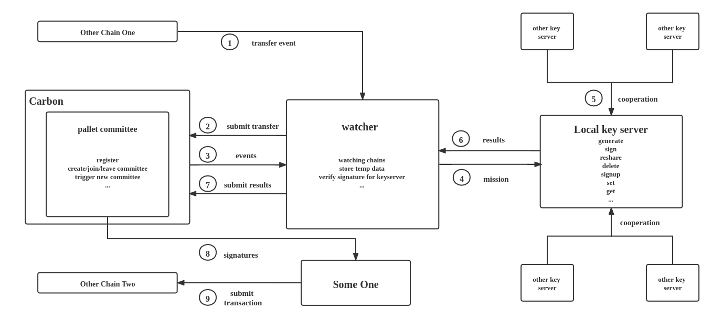

# Committee Design


## 1. pallet-comittee
链上的合约，功能包括：

1. 创建committee/加入/退出
```rust
fn create_committee(origin, t: u16, n: u16, chains: (Vec<u8>, Vec<u8>), info: Vec<u8>, fee: (u32, u32));

fn register(origin, pubkey: Vec<u8>, url: Vec<u8>);

fn quit(origin);
```

2. 提交签名消息(由链观测者上交)
```rust
fn report_transaction(origin, cid: CommitteeId, epoch: u32, message: Vec<u8>, from: Vec<u8>, to: Vec<u8>);
```

3. 提交签名结果或者上链结果(待定，由负责的committee成员提交，验证签名)
```rust
fn submit_result(origin, cid: CommitteeId, hash: Hash, signature: Vec<u8>);
```

4. 要求超时的任务重做
```rust
fn request_sign(origin, cid: CommitteeId, hash: Hash);
```

5. 周期性自动触发committee换届。
```rust
fn on_finalize(n: T::BlockNumber) {
    Self::do_finalize(n);
}
```

## 2. watcher
监测链上的事件和存储等

1. 检测节点事件，触发generate/sign/reshare等操作。

2. 负责上链签名结果。

## 3. key-server
本地的另一个服务，负责mpc计算

1. 负责generate/sign/reshare/delete等实际计算。接口为 “https://localhost:8001/command”。
```rust
#[derive(Clone, Debug, Serialize, Deserialize)]
pub enum MissionParam {
    Get(GetParam),
    Set(SetParam),
    Signup(SignupParam),
    GENERATE(GenerateParams),
    PreSign(PreSignParams),
    SIGN(SignParams),
    RESHARE(ReshareParams),
    DELETE(DeleteParams),
}

pub struct GenerateParams {
    pub cid: u64,
    pub sid: u64,
    pub params: Parameters,
    pub url: String,
}

pub struct PreSignParams {
    pub cid: u64,
    pub sid: u64,
    pub params: Parameters,
    pub parties_key: String,
    pub url: String,
}

pub struct SignParams {
    pub cid: u64,
    pub sid: u64,
    pub params: Parameters,
    pub message: Vec<u8>,
    pub chain_type: String,
    pub url: String,
}

pub struct ReshareParams {
    pub cid: u64,
    pub sid: u64,
    pub old_params: Parameters,
    pub new_params: Parameters,
    pub is_old: bool,
    pub is_new: bool,
    pub url: String,
}

pub struct DeleteParams {
    pub cid: u64,
}
```

2. 如果是被committee选中的特殊成员，需要负责成员间消息的临时存储和转发。此处特指MissionParam中的Get， Set，Signup三个操作
```rust
#[derive(Clone, Debug, Serialize, Deserialize)]
pub struct SetParam {
    pub key1: String,
    pub key2: String,
    pub data: String,
}

#[derive(Clone, Debug, Serialize, Deserialize)]
pub struct GetParam {
    pub key1: String,
    pub key2: String,
}

pub struct SignupParam {
    pub cid: u64,
    pub sid: u64,
    pub count1: u16,
    pub count2: u16,
    pub is_old: bool,
    pub is_new: bool,
}
```

## 4. 各链的上链节点
监测boolnetwork链，将对应的签名提交到自己负责的链，以完成跨链最后一步。
