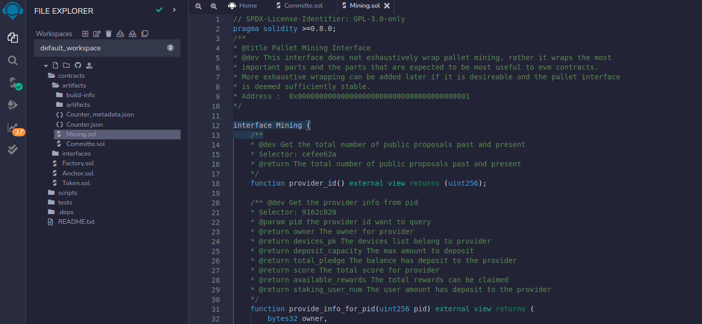

# Connect Metamask

## Compare normal chain with BoolNetwork in compatible with ethereum
## Common: 


## BoolNetwork:


## Install the MetaMask Extension and create one account


## Start bnk-node
```
git clone https://github.com/ABMatrix/boolnetwork.git
cd boolnetwork/node
cargo build --release
./target/release/bnk-node --dev --tmp --rpc-port 9933
```

## Link chain with polkadot.js apps:
```
https://polkadot.js.org/apps/#/explorer
```
### Note: need switch to Local Node
```
ws://127.0.0.1:9944
```

## Link EVM with MetaMask
### 1. Enter Settings


### 2. Select Networks and add New Network


### 4. RPC URL is binding with bnk-node, Chain ID is defined in the node runtime


### 5. Select BoolNetwork


## Create new account in Substrate using Private Key for MetaMask's account
### 1. Select Account Details and export Private Key


### 2. Type MetaMask password


### 3. Copy the Private Key and use it to create new account in substrate


### Check new account in substrate, account id is same as metamask address


## Deposit balance from Substrate into MetaMask

### *There are two options to deposit:

### *Option1: Transfer by metamask: 
### 1. Add development account(prefunds account) to metamask
```
alith sk: 0x5fb92d6e98884f76de468fa3f6278f8807c48bebc13595d45af5bdc4da702133
```


### 2. Send some balance from Alith to Account1


### 3. Waiting for transaction complete


### 4. Check Account1's balance


### *Option2: Transfer by Polkadot.js apps:

### 1. Send balance by Alith


### 2. Check Event and Account1


## Create contract and call it in EVM
### 1. Create a contract by sending transaction


### 2. Get contract address


### Note: This contract deploy some tokens to the creator

### 3. Check the contract address code storage


### 4. Get the index hash about creator address

```
curl http://localhost:9933 -H "Content-Type:application/json;charset=utf-8"   -d '{"jsonrpc":"2.0","id":1,"method":"eth_getIndex","params": ["0x1D2A512EaE004AE78bA2353fc2d3596FCfb95F0E", "0x00"]}'
{"jsonrpc":"2.0","result":"0xd5d6d8faa68d702d04eb9fbf19f017ff823fa4fef6abc5df39b31c12035a8d8b","id":1}
```

### 5. Check token number about the creator address


### 6. Transfer some token to target address(0x7E6F241a60C9D557a412B66845bfe10CCFD82E4A)


### Note: transfer number is "0x00000000000000000000000000000000000000000000000000000000000000dd"

### 7. Get the index hash about recipient address

```
curl http://localhost:9933 -H "Content-Type:application/json;charset=utf-8"   -d '{"jsonrpc":"2.0","id":1,"method":"eth_getIndex","params": ["0x7E6F241a60C9D557a412B66845bfe10CCFD82E4A", "0x00"]}'
{"jsonrpc":"2.0","result":"0x34902750012c0610301474fd3c9af861bc73615fd2e034fc43d5a5231cad2fac","id":1}
```

### 8. Check token number about the recipient address


## Use precompile to connect with substrate
### 1. Copy Mining.sol(node/pallets/evm/precompile/mining) to Remix IDE



### 2. Compile Mining.sol


### 3. Select Deploy tap, Select Environment with "Injected Provider - MetaMask" and It will choose the metamask account
### Copy the address in Mining.sol to "At Address" and click it


### 4. Now user can send substrate transaction and query substrate storage by the contract(ig. call pallet-mining tx-function: create)


### 5. Check event in substrate chain


### 6. Query pallet-mining storage: provider_id, it will change to "1"


