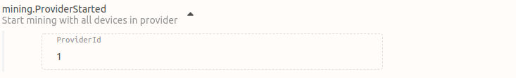

# Operation Tutorials(pallets)
## Facility -> Mining -> Committee
## Pallet-Facility:
### After starting the 'bnk-key-server' and 'bnk-watcher'(both need to set config), it will register the device by send a transaction automatically.
### User can check extrinsic and event in [polkadot.js apps](https://polkadot.js.org/apps/#/explorer)

### Get device's detail info by [polkadot.js apps](https://polkadot.js.org/apps/#/chainstate)

### User also can unregister the device by sending a transaction in facility
#### Note: The transaction will be failed  due to the device in working state, therefore user should stop the working device by pallet-mining 'stop_mint'

## Pallet-Mining: 
### After registering the device in facility, user can control the device to start mining(need to process a provider and mount the device).
### Pallet-Mining also provider function to deposit(Withdraw) balance to the target pid(provider id), it means receiving more rewards after a session.
### 1. create a new provider

### event:

### 2. mount the device 

### event: 

### Note: As like unregister in pallet-Facility, unmount also need device's state is 'Stop' 
### 3. start mining.
### change all devices' state to 'Working' which belong to the provider.

### event: 

### check chain storage for provider info and device info.

### 4. deposit balance to provider(provider's capacity should be set before)
### set deposit capacity

### try to deposit

### Note: withdraw balance from a provider must after minimum period

### 5. heartbeat(im_online)
### when the device is 'Working'(start mining), it will need to send heartbeat every session to verify their liveness.

### Successful heartbeat verification will add device's score to receive more rewards. 
### If device's heartbeat was not sending to verify or verify failed, it will be punished.

### 6. challenge result
### If user suspect validator's verification about the heartbeat, they can challenge the result(must in valid session).
### It will get rewards if challenge successfully

### 7. claim rewards
### check account's stake ledger

### claim rewards(it will claim all rewards belong ot the account)

### event:

### 8. stop mining
### change all devices' state to 'Stop' which belong to the provider, and will not need to send heartbeat at next session.

## Pallet-Committee: 
### Working devices can register in pallet-committee, and then can enter to a new committee create via VRF.
### User can create channel to complete a cross-chain transaction.

### 1. join to the pool which inner devices is ready to enter committee.

### 2. exit 
### There are two ways to exit from committee:\
### (1) Gently exit is exit from the register pool, that means it doesn't want to join committee at next epoch.

### (2) Force exit is exit from the target cid, we only care about the latest epoch for the committee and fork, force exit means it will be moved from the rewards list.

### 3. create a new committee
### After sending the transaction, a committee is created with the parameters, and will cost some time to fork and apply.
### If all forks is report changes and the anchor address is binding with the committee, the committee's state will change to 'Working'.

### After creating successfully, committee will members will change every epoch.

### 4. create a new channel
### There are three ways to create a channel: 
### (1) the first is creating two new committees and binding with the channel. 
### (2) the second is binding with creating a new committees and an existing committee. 
### (3) the last is binding with two existing committees
### It will spend such time to waiting the committee create if select the first and second ways to create a channel.

### If each of the committees that bind with a channel is 'Working', the channel will activate automatically. Only working channel can try to complete cross-chain transaction.

### 5. channel working
### When a cross-chain transaction is sending by 'bnk-relayer', committee's fork members will try to sign and submit result to the chain(only the fastest fork parity will submit successfully).

### Committee will receive rewards after submitting a result successfully.
### Channel creator can request committee to sign again if committee sign or submit result failed.

### 6. expose identity and receive rewards
### The parameter contains temporary public key in committee members, and signature belong to the pk.
### It allows sending rewards to a target account.

### 7. report committee member evil
### Only each member in the same committee list(epoch, fork_id) can report other members evil.
### Member's rewards will be moved from the rewards list When the report number for the member at committee's threshold.

